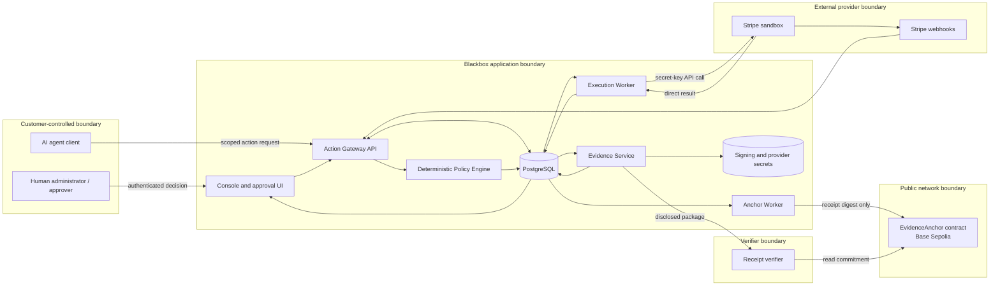

# Project Blackbox — Product Architecture

| Document metadata | Value |
| --- | --- |
| Owner and final decision-maker | Malcolm Henzaga |
| Maintained by | Malcolm, with Asa and Codex |
| Version | 1.0 |
| Created / last updated | 2026-09-15 |
| Status | Active V0 build contract; implementation has not yet been verified |
| Classification | Private internal project context |
| Intended readers | Malcolm, Asa, Codex, future engineers, security reviewers, and approved collaborators |
| Canonical destination | `Project-Blackbox/docs/PRODUCT_ARCHITECTURE.md` |
| Depends on | `MASTER_CONTEXT.md`, `BUILD_PHILOSOPHY.md` |
| Primary scope | V0 Stripe sandbox refund, human approval, signed receipt, Base Sepolia commitment, and independent verification |

> **V0 architectural promise:** A registered agent can request a Stripe sandbox refund through the Blackbox gateway. Deterministic policy evaluates the request, a qualified human approves when required, Blackbox executes at most one logical refund, records the provider outcome, issues a signed receipt, commits its digest to Base Sepolia, and lets a verifier detect altered evidence.

This document defines the system engineers should build. It does not claim that the system already exists, has passed the tests below, is secure for production, or has customer validation.

## 1. Purpose

Project Blackbox is intended to sit between an AI agent and a consequential external action. V0 proves this with one financial workflow: a refund through Stripe’s sandbox environment.

The architecture must make five relationships explicit:

1. **Authority:** Who allowed this agent to act, and within which limits?
2. **Policy:** Why was this request allowed, denied, or sent for approval?
3. **Execution:** What did Blackbox ask the external provider to do?
4. **Outcome:** What result did the provider report, and how was it reconciled?
5. **Evidence:** Which parts of the record can another party verify?

The product should never imply that a policy decision proves execution, that an API request proves final outcome, or that a blockchain commitment proves completeness or truth.

## 2. Scope and architectural status

### V0 includes

- One organization in a controlled demonstration environment.
- One registered refund agent.
- One human delegator/approver role, with a separate unauthorized-user fixture for negative tests.
- One versioned mandate and one deterministic refund policy.
- Three policy outcomes: `ALLOW`, `REQUIRE_APPROVAL`, and `DENY`.
- Stripe sandbox payment and partial-refund execution.
- Persisted idempotency and provider-result reconciliation.
- Signed, versioned action receipts with data minimization.
- One receipt digest committed per transaction to a simple Base Sepolia contract.
- A console for actions, approvals, receipts, and operational counts.
- An export and verifier that can detect altered receipt content.

### V0 does not include

- Production funds, customer custody, or a live payment product.
- Full enterprise tenancy, production identity governance, or customer-cloud deployment.
- An insurance product, actuarial score, compliance certification, or claim adjudication.
- Proof that every action outside the controlled gateway route was captured.
- AI-generated production policies or LLM authority decisions.
- MCP, x402, ERC-8004, BNB Chain, multiple providers, or multiple action types.
- Zero-knowledge proofs, selective-disclosure credentials, batch Merkle commitments, validators, or a token.
- Production-grade key management, disaster recovery, or high-availability guarantees.

Future capabilities appear only to protect portability and avoid architectural dead ends. They are not V0 requirements.

## 3. Architectural goals

1. **Enforce before execution.** A covered refund cannot reach Stripe without passing identity, mandate, policy, and approval checks.
2. **Use deterministic authority controls.** Permission boundaries are code and data, not model judgment.
3. **Bind approval to the exact action.** Changing material action data invalidates the approval.
4. **Represent uncertainty honestly.** Timeouts and ambiguous provider results become `UNKNOWN`, not success or failure by guess.
5. **Prevent duplicate side effects.** A logical refund uses one persisted provider idempotency key across retries.
6. **Keep evidence useful and minimal.** Store and export only the fields required for the demonstrated claim.
7. **Separate private evidence from public proof.** No customer, payment, policy, or approval detail goes onchain in V0.
8. **Make verification reproducible.** A verifier can recompute the digest, check the issuer signature, and confirm the Base commitment.
9. **Keep providers replaceable.** The domain model should not collapse into Stripe-specific objects.
10. **Keep the demo explainable.** Malcolm should be able to walk through every state and trust boundary.

## 4. Definitions

| Term | Meaning in this architecture |
| --- | --- |
| Organization | The company that owns the agent, mandate, policy, and provider connection |
| Human principal | The accountable person acting for the organization |
| Agent | Software authenticated to request a bounded action |
| Mandate | A versioned delegation describing what an agent may attempt and when |
| Policy | Deterministic rules that evaluate a normalized action under a mandate |
| Action | One immutable, versioned request for a consequential operation |
| Approval binding | Digest of the exact action, mandate version, and policy version being approved |
| Execution attempt | One recorded attempt to call the external provider for a logical action |
| Provider observation | A signed webhook, direct response, or retrieved provider object used to assess outcome |
| Receipt core | Canonical, signed evidence object describing authority, decision, execution, and observations |
| Receipt package | Receipt core plus signature, issuer key information, and later anchor proof |
| Commitment | A public-chain record of the receipt-core digest |
| Verification | A scoped check of structure, digest, signature, and optional onchain commitment |
| Covered route | The provider credential and integration path that Blackbox actually controls |

## 5. Actors and authority

| Actor | Can do | Cannot do in V0 |
| --- | --- | --- |
| Organization administrator / delegator | Register the agent; activate, revoke, or replace the mandate and policy; assign approvers | Alter historical action or receipt records |
| Authorized approver | Approve or reject a pending action bound to the displayed digest | Approve a hard denial, expired request, changed action, or action outside their role |
| Unauthorized user fixture | View only what its test role permits | Decide an approval |
| Agent client | Submit a supported refund request and read its status using scoped credentials | Create its own mandate, change policy, approve itself, access Stripe credentials, or execute directly through Blackbox internals |
| Gateway service | Authenticate, validate, evaluate, coordinate approval, and schedule execution | Invent authority or treat an LLM output as permission |
| Execution worker | Recheck authority and invoke Stripe with the persisted operation key | Change the approved action or use an unrelated provider credential |
| Evidence issuer | Create and sign a receipt from recorded facts | Turn missing evidence into a `verified` claim |
| Anchor worker | Commit the receipt digest to the configured Base Sepolia contract | Publish the private receipt or redefine its digest |
| Verifier | Check a disclosed package and public commitment | Establish omitted events, legal liability, or safety beyond the evidence scope |

Malcolm is the V0 organization administrator and authorized approver in the demonstration. The test suite must also use a distinct unauthorized identity; a role label displayed in the browser is not sufficient authorization.

## 6. System context and trust boundaries



### Trust assumptions

- The organization trusts Blackbox to enforce the configured rules on the **covered route**.
- Blackbox trusts authenticated administrators and approvers within their assigned roles.
- The verifier must trust the binding between Blackbox and its issuer public key; a valid signature proves possession of a key, not the signer’s real-world identity by itself.
- Provider observations inherit trust in Stripe, its API response, and verified webhook signature.
- Base Sepolia supplies public block-inclusion and ordering evidence suitable for a testnet demonstration; its block time is not trusted as an exact real-world event timestamp, and the network is not a production service-level guarantee.
- Blackbox controls the initial provider credential in V0. If the same organization or agent holds another usable Stripe secret, Blackbox cannot claim complete capture.
- V0 does not prove that recorded inputs were true or that all relevant external activity was disclosed.

## 7. Data classification and placement

| Class | Examples | V0 placement |
| --- | --- | --- |
| Secret | Stripe secret key, webhook signing secret, agent credential, receipt signing private key, Base transaction key | Server-side secret store or deployment environment only; never database plaintext, browser, logs, receipt, or chain |
| Restricted | User identity, provider object IDs, mandate contents, approval record, action payload, selected provider response | PostgreSQL with organization scope; excluded or pseudonymized in public exports where possible |
| Internal | Policy version, internal action ID, operational error, retry state | PostgreSQL and restricted operational logs |
| Disclosed evidence | Redacted receipt package chosen for verification | Download or verifier input; contents visible to recipient |
| Public | Receipt digest, schema identifier, issuer address, contract address, transaction and block reference | Base Sepolia and public verification view |

V0 does not store raw model prompts, chain-of-thought, card details, or unnecessary customer profiles. The agent submits a structured refund request. If an optional model turns natural language into that request, its raw prompt is ephemeral by default and its output remains untrusted until schema validation.

## 8. V0 demonstration contract

### Seeded fixture

- A separate successful Stripe sandbox PaymentIntent for **$1,000 USD** for each scenario that may create a refund. Tests must not reuse a partially refunded payment across scenarios.
- One active refund mandate for the registered agent.
- One deterministic policy with the following demonstration values:

| Rule | Result |
| --- | --- |
| Action is not `stripe.refund` | `DENY` |
| Mandate is inactive, expired, revoked, or does not match the agent/provider | `DENY` |
| Currency is not USD | `DENY` |
| Requested amount is not positive or exceeds the provider’s remaining refundable amount | `DENY` |
| Amount is at most $500 | `ALLOW` |
| Amount is above $500 and at most $1,000 | `REQUIRE_APPROVAL` |
| Amount is above $1,000 | `DENY` |

The amounts are demo fixtures, not recommended customer policy.

### Required scenarios

1. **Automatic path:** $300 request → `ALLOW` → one sandbox refund → signed receipt.
2. **Human path:** $750 request → `REQUIRE_APPROVAL` → no refund while pending → qualified approval → one sandbox refund → signed and anchored receipt.
3. **Denial path:** $1,250 request → `DENY` → zero Stripe refund calls → decision evidence.
4. **Rejection path:** $750 request → qualified rejection → zero Stripe refund calls.
5. **Binding path:** approve $750, then change the amount or target → original approval cannot be reused.
6. **Tamper path:** change a field in an exported receipt copy → digest or signature verification fails.
7. **Uncertain path:** simulate loss of the direct provider response → preserve one idempotency key → reconcile before claiming an outcome.

The principal demo for the YZi application is scenario 2 followed by scenario 6.

## 9. Core invariants

The implementation must preserve these properties:

1. Monetary amounts are positive integers in the currency’s smallest unit. V0 uses USD cents.
2. An action’s material payload becomes immutable after policy evaluation. A change creates a new action version and evaluation.
3. Mandates and policies are immutable versions. Activation or revocation creates a new event; history is preserved.
4. Policy evaluation is deterministic for the same normalized action and versioned inputs.
5. An approval binds the action version, normalized payload digest, mandate version, and policy version.
6. A hard `DENY` cannot be overridden by an approval.
7. Execution begins only after a valid policy decision and, when required, a valid unexpired approval.
8. The execution worker rechecks authority and binding immediately before the provider call.
9. One logical action has one persisted provider idempotency key; retries reuse it.
10. A request timeout produces an unknown result until reconciliation; it never triggers a new logical operation key.
11. Provider webhook events are signature-verified and deduplicated before they influence outcome state.
12. A receipt reports recorded facts and evidence level; it never upgrades an unknown provider outcome to success.
13. The signed receipt core is immutable. Anchor metadata is attached outside that signed core because it becomes available later.
14. Anchoring failure does not change the recorded provider outcome. It changes only the anchor state.
15. The public chain receives only the receipt digest and schema identifier in V0.
16. Verification reports separate results for schema, digest, signature, issuer trust, and anchor confirmation.

## 10. Domain state model

A single `status` field would hide important differences. Maintain five orthogonal state tracks.

### 10.1 Intake state

```text
RECEIVED
    ↓
VALIDATING
    ├──► READY_FOR_POLICY
    ├──► INVALID
    └──► DEPENDENCY_UNAVAILABLE ──► VALIDATING
```

`DEPENDENCY_UNAVAILABLE` covers a required provider read or other validation dependency that could not be established. It does not become a policy denial, because the system lacks the facts needed to evaluate the request.

### 10.2 Policy decision

```text
NOT_EVALUATED
    ├── ALLOW
    ├── REQUIRE_APPROVAL
    └── DENY
```

Every result records a machine-readable reason code and human-readable explanation. The explanation is descriptive; the reason code and evaluated facts drive behavior.

### 10.3 Approval state

```text
NOT_REQUIRED
PENDING ──► APPROVED
    ├─────► REJECTED
    ├─────► EXPIRED
    └─────► INVALIDATED
```

`INVALIDATED` covers action changes, mandate/policy replacement, authority revocation, or a binding mismatch before execution.

### 10.4 Execution state

```text
NOT_STARTED
    ↓
QUEUED
    ↓
EXECUTING
    ├──► SUCCEEDED
    ├──► FAILED
    └──► UNKNOWN ──► RECONCILING ──► SUCCEEDED | FAILED | UNKNOWN
```

`UNKNOWN` is a first-class state. Reconciliation can remain unresolved and must be visible.

### 10.5 Evidence state

```text
NOT_ISSUED
    ↓
SIGNED
    ↓
ANCHOR_PENDING
    ├──► ANCHORED
    └──► ANCHOR_FAILED ──► ANCHOR_PENDING
```

Verification is computed, not stored as permanent truth:

- `VALID`: schema, digest, signature, trusted issuer, and requested anchor checks pass.
- `VALID_UNANCHORED`: schema, digest, signature, and issuer pass; no confirmed anchor is claimed.
- `INVALID`: at least one required check fails.
- `INCOMPLETE`: required proof material or trust configuration is absent.

## 11. End-to-end approval flow

```mermaid
sequenceDiagram
    autonumber
    participant Agent
    participant Gateway
    participant Policy
    participant DB
    participant Human
    participant Worker
    participant Stripe
    participant Evidence
    participant Anchor
    participant Base

    Agent->>Gateway: POST structured refund + idempotency key
    Gateway->>Gateway: Authenticate and validate schema
    Gateway->>DB: Persist immutable action version
    Gateway->>Policy: Evaluate action + mandate + policy versions
    Policy-->>Gateway: REQUIRE_APPROVAL + reason codes
    Gateway->>DB: Persist decision and approval binding
    Gateway-->>Agent: 202 awaiting_approval
    Human->>Gateway: Approve exact binding digest
    Gateway->>DB: Authenticate role; persist decision
    Worker->>DB: Lock action; recheck authority and binding
    Worker->>DB: Persist EXECUTING + provider idempotency key
    Worker->>Stripe: POST /v1/refunds in sandbox
    Stripe-->>Worker: Refund object or uncertain response
    Worker->>DB: Persist observation and outcome state
    Evidence->>DB: Read immutable recorded facts
    Evidence->>Evidence: Canonicalize, hash, and sign receipt core
    Evidence->>DB: Persist signed package + anchor job
    Evidence-->>Human: Receipt available; anchor pending
    Anchor->>DB: Claim anchor job
    Anchor->>Base: commit(digest, schemaId)
    Base-->>Anchor: Transaction receipt and later confirmations
    Anchor->>DB: Persist anchor state
```

The external call and database update cannot share one atomic transaction. Persisting the operation key before the call and reconciling afterward closes the most dangerous gap.

## 12. Component responsibilities

### 12.1 Console and approval UI

The web application provides:

- overview counts derived from recorded data;
- action list and action detail;
- clear policy, approval, execution, evidence, and anchor states;
- pending-approval queue;
- an approval view showing the exact action, amount, currency, target reference, mandate, policy, reason, and binding digest;
- receipt export and verification view; and
- configuration view for the demo agent, mandate, and policy.

The interface must distinguish `DENIED`, `REJECTED`, `FAILED`, `UNKNOWN`, `SIGNED`, `ANCHOR_PENDING`, `ANCHORED`, and `INVALID`. “Needs approval” is a normal state, not an error.

### 12.2 Action Gateway API

The gateway:

- authenticates the agent credential and derives organization and agent identity from it;
- validates the request against a strict schema;
- normalizes currency and provider references;
- persists the immutable action request before any required external validation read;
- retrieves the active mandate and policy versions;
- retrieves the Stripe object needed to validate refundable amount;
- persists the source observations;
- runs the deterministic policy;
- creates an approval request or execution job; and
- returns the current state and links.

The API does not accept a caller-supplied organization ID, authority result, policy decision, approval, or provider secret as trusted input.

### 12.3 Deterministic Policy Engine

The policy engine is a pure domain module where possible:

```text
evaluate(normalizedAction, agent, mandateVersion, policyVersion, providerFacts, evaluatedAt)
    → decision
    → reasonCodes[]
    → evaluatedFacts
    → approvalRequirements?
```

It performs no Stripe call, database write, model request, or blockchain transaction. The caller supplies versioned inputs. The result can therefore be tested and replayed.

Suggested V0 reason codes include:

- `AGENT_NOT_AUTHORIZED`
- `MANDATE_INACTIVE`
- `MANDATE_EXPIRED`
- `ACTION_NOT_ALLOWED`
- `CURRENCY_NOT_ALLOWED`
- `INVALID_AMOUNT`
- `EXCEEDS_PROVIDER_REMAINING_AMOUNT`
- `WITHIN_AUTONOMOUS_LIMIT`
- `HUMAN_APPROVAL_REQUIRED`
- `EXCEEDS_MAXIMUM_LIMIT`

### 12.4 Approval Service

The approval service:

- creates an expiring request for the action binding digest;
- authenticates the human user and checks organization role;
- displays the material facts before decision;
- accepts one terminal decision for a binding;
- records approver identity, role, decision time, reason, and binding;
- invalidates approval when the action or governing versions change; and
- queues execution only after a fresh final recheck.

V0 uses a short configurable expiration, such as 15 minutes, to demonstrate stale-approval handling. The value is a demo setting, not a universal product rule.

### 12.5 Execution Orchestrator

The orchestrator:

1. locks the action against concurrent execution;
2. verifies policy, approval, mandate, and action binding;
3. persists an opaque provider operation ID and idempotency key;
4. commits `EXECUTING` before crossing the provider boundary;
5. calls the selected adapter;
6. records the direct response or error without secrets;
7. classifies the result as succeeded, failed, or unknown;
8. schedules reconciliation when needed; and
9. emits a receipt-generation job when the outcome reaches a reportable state.

The worker never creates a new idempotency key to “try again” after an ambiguous result.

### 12.6 Stripe Refund Adapter

The adapter maps the normalized action to Stripe’s sandbox refund endpoint. Stripe currently accepts a Charge or PaymentIntent when creating a refund, represents the amount in the currency’s smallest unit, and prevents refunds beyond the remaining refundable amount. [Stripe refund API](https://docs.stripe.com/api/refunds/create)

V0 uses:

- `POST /v1/refunds` through the official server-side Stripe library;
- a PaymentIntent reference;
- a positive integer amount in cents;
- an opaque, persisted idempotency key; and
- minimal metadata containing an opaque Blackbox operation reference.

Stripe recommends idempotency keys for safely retrying POST operations. Repeated calls with the same key return the stored result within the provider’s supported retention window, while reuse with different parameters is rejected. Blackbox must keep its own durable operation record and not treat provider retention as permanent deduplication. [Stripe idempotency](https://docs.stripe.com/api/idempotent_requests)

The adapter exposes provider-neutral results:

```text
ProviderResult =
  | { kind: "accepted", providerOperationId, providerStatus, observedAt, evidence }
  | { kind: "rejected", providerErrorCode, observedAt, evidence }
  | { kind: "unknown", errorClass, observedAt, retryGuidance }
```

### 12.7 Stripe Webhook Ingestor

The webhook endpoint must:

- receive the raw request body;
- verify the `Stripe-Signature` using the endpoint secret;
- reject invalid signatures;
- persist the event ID and relevant object identity;
- deduplicate repeated delivery;
- return a successful response quickly; and
- process state changes asynchronously.

Stripe documents signature verification over the raw body, recommends asynchronous handling, and warns that duplicate event delivery can occur. V0 listens only for required refund events such as `refund.created`, `refund.updated`, and `refund.failed`. [Stripe webhooks](https://docs.stripe.com/webhooks) [Stripe event types](https://docs.stripe.com/api/events/types)

Webhook arrival does not blindly overwrite a newer observation. Reconciliation compares provider object identity and status according to an explicit precedence rule.

### 12.8 Reconciliation Worker

Reconciliation handles actions in `UNKNOWN`, pending provider states, and missed or delayed webhooks.

- If a provider refund ID is known, retrieve that refund.
- If the call outcome was lost before an ID was recorded, safely replay with the same Stripe idempotency key while it remains supported.
- Compare the latest provider object with recorded events.
- Preserve the observation source and time.
- Stop after a bounded retry schedule and leave the outcome `UNKNOWN` if it cannot be established.
- Allow an administrator to trigger a read-only recheck without creating a new logical refund.

### 12.9 Evidence Service

The evidence service builds a receipt from immutable database records. It must not take a caller’s claim that execution succeeded.

V0 cryptographic profile:

- Canonicalization: JSON Canonicalization Scheme, RFC 8785, using a tested library.
- Digest: SHA-256 of the UTF-8 canonical receipt-core bytes.
- Signature: Ed25519 over the canonical receipt-core bytes.
- Key reference: stable issuer key ID plus public-key fingerprint.
- Encoding: base64url for binary signature/key material; lowercase hexadecimal with `0x` prefix for onchain `bytes32` digest.

Do not implement cryptographic primitives or canonicalization by hand. This profile is a working V0 choice to review in `SECURITY_PRINCIPLES.md` before production.

### 12.10 Anchor Worker and EvidenceAnchor contract

The anchor worker submits only the receipt digest and schema identifier to Base Sepolia. Base’s official documentation lists Base Sepolia as testnet chain ID `84532`. Public endpoints are suitable for development and are rate limited; a production design should use a supported provider and monitor finality assumptions. [Base RPC overview](https://docs.base.org/base-chain/api-reference/rpc-overview)

Minimal contract behavior:

```solidity
event EvidenceCommitted(
    address indexed issuer,
    bytes32 indexed digest,
    bytes32 indexed schemaId
);

function commit(bytes32 digest, bytes32 schemaId) external;

function committedAtBlock(address issuer, bytes32 digest)
    external view returns (uint256);
```

Required properties:

- commitment identity includes the submitting issuer address;
- the same issuer cannot create a conflicting second record for the same digest;
- commitments cannot be edited or deleted through the contract;
- the event and lookup contain no private receipt data;
- contract address, chain ID, and expected issuer address are verifier configuration;
- tests cover duplicate submission and lookup behavior.

V0 commits each receipt separately for demo clarity. Later batching with a Merkle root is a separate design.

The anchor worker records transaction hash, block number, observed block hash, and confirmation count. For the demo, `ANCHORED` requires a configurable minimum such as two confirmations. Reorganization handling can return the state to pending. The exact production finality policy is unresolved.

### 12.11 Receipt Verifier

The verifier accepts a receipt package and trusted configuration. It performs checks independently of the action dashboard:

1. Validate the schema and supported cryptographic profile.
2. Extract the receipt core and canonicalize it.
3. Recompute SHA-256 and compare it with the package digest.
4. Verify the Ed25519 signature against the provided public key.
5. Check that the public-key fingerprint and configured issuer identity match.
6. If anchor proof is requested, connect to Base Sepolia and confirm the expected contract, chain ID, issuer address, digest, block, and confirmation policy.
7. Report each check separately with evidence and explanation.

The verifier must not reduce those checks to one unexplained green badge. A valid package proves that the disclosed receipt matches what the issuer signed and, if anchored, the public commitment. It does not prove completeness, legal admissibility, correct human judgment, or safe agent behavior.

The strongest V0 implementation is an open, locally runnable verifier package plus a browser interface using the same core library. A browser-only page hosted by Blackbox is useful for the demo but less independent.

## 13. API contract

V0 routes are private preview interfaces under `/api/v0`; they are not a stable public API commitment.

### 13.1 Submit action

`POST /api/v0/actions`

Headers:

```http
Authorization: Bearer <agent-credential>
Idempotency-Key: <unique-client-request-key>
Content-Type: application/json
```

Body:

```json
{
  "actionType": "stripe.refund",
  "providerConnection": "stripe_sandbox_default",
  "target": {
    "paymentIntentId": "pi_test_reference"
  },
  "amount": {
    "currency": "usd",
    "minorUnits": 75000
  },
  "reason": "requested_by_customer"
}
```

The server derives the organization and agent from the credential. Unknown fields are rejected. The client idempotency key deduplicates action creation; it is separate from the provider operation key used later.

Example response:

```json
{
  "actionId": "act_...",
  "actionVersion": 1,
  "policy": {
    "decision": "REQUIRE_APPROVAL",
    "reasonCodes": ["HUMAN_APPROVAL_REQUIRED"]
  },
  "approval": {
    "state": "PENDING",
    "expiresAt": "2026-09-15T18:15:00Z",
    "bindingDigest": "sha256:..."
  },
  "execution": { "state": "NOT_STARTED" },
  "evidence": { "state": "NOT_ISSUED" }
}
```

### 13.2 Read action

`GET /api/v0/actions/{actionId}`

Returns the five state tracks, reason codes, safe action details, event timeline, and links available to the authenticated role.

### 13.3 Decide approval

`POST /api/v0/approvals/{approvalId}/decisions`

```json
{
  "decision": "APPROVE",
  "bindingDigest": "sha256:...",
  "reason": "Customer request and remaining refundable amount verified"
}
```

The server authenticates the human, checks their role and the exact binding, persists the terminal decision, and queues execution. It rejects stale, changed, expired, already-decided, or unauthorized attempts.

### 13.4 Export receipt

`GET /api/v0/receipts/{receiptId}/export`

Returns the disclosed receipt package for an authorized user. V0 has one predefined disclosure profile. Later versions may generate selective packages without modifying the signed core semantics.

### 13.5 Verify receipt

`POST /api/v0/verify` may support the demo UI, but the core verifier must also run without trusting this endpoint.

### 13.6 Stripe webhook

`POST /api/v0/webhooks/stripe`

This route uses raw-body signature verification and has no agent or user session. It trusts only a valid Stripe signature for the configured sandbox account and still deduplicates/reconciles the event.

## 14. Receipt architecture

### 14.1 Receipt core

The signed core should contain:

```json
{
  "schema": "blackbox.action-receipt",
  "schemaVersion": "0.1.0",
  "receiptId": "rcpt_...",
  "issuedAt": "2026-09-15T18:04:30Z",
  "issuer": {
    "issuerId": "project-blackbox-v0",
    "keyId": "key_..."
  },
  "scope": {
    "environment": "test",
    "coveredRoute": "stripe_sandbox_default",
    "coverageClaim": "gateway_observed"
  },
  "subject": {
    "organizationRef": "org_pseudonymous_ref",
    "agentRef": "agent_ref",
    "agentVersion": "demo-1"
  },
  "authority": {
    "mandateRef": "mandate_ref",
    "mandateVersion": 1,
    "mandateDigest": "sha256:...",
    "activeAtEvaluation": true,
    "activeAtExecution": true
  },
  "action": {
    "actionId": "act_...",
    "actionVersion": 1,
    "actionType": "stripe.refund",
    "targetRef": "pseudonymous_payment_ref",
    "amountMinor": 75000,
    "currency": "usd",
    "requestDigest": "sha256:..."
  },
  "policy": {
    "policyRef": "policy_ref",
    "policyVersion": 1,
    "policyDigest": "sha256:...",
    "decision": "REQUIRE_APPROVAL",
    "reasonCodes": ["HUMAN_APPROVAL_REQUIRED"],
    "evaluatedAt": "2026-09-15T18:00:00Z"
  },
  "approval": {
    "required": true,
    "decision": "APPROVED",
    "approverRef": "human_ref",
    "bindingDigest": "sha256:...",
    "decidedAt": "2026-09-15T18:02:00Z"
  },
  "execution": {
    "provider": "stripe",
    "providerEnvironment": "sandbox",
    "operationRef": "op_...",
    "providerObjectRef": "pseudonymous_ref",
    "attemptedAt": "2026-09-15T18:03:00Z",
    "observedState": "SUCCEEDED",
    "observedAt": "2026-09-15T18:04:00Z",
    "observationSources": ["direct_response", "verified_webhook"]
  },
  "evidence": {
    "level": "PROVIDER_CONFIRMED",
    "recordedEventCount": 8,
    "evidenceManifestDigest": "sha256:...",
    "limitations": [
      "Covers only the configured Blackbox gateway route",
      "Does not prove absence of actions made with other credentials"
    ]
  }
}
```

This is a conceptual schema. Field names and disclosure choices should be finalized in code with JSON Schema and test vectors before external use.

### 14.2 Receipt package

```json
{
  "receiptCore": {},
  "cryptographicProof": {
    "canonicalization": "RFC8785-JCS",
    "digestAlgorithm": "SHA-256",
    "digest": "0x...",
    "signatureAlgorithm": "Ed25519",
    "signature": "base64url...",
    "publicKey": "base64url...",
    "publicKeyFingerprint": "sha256:..."
  },
  "anchorProof": {
    "state": "ANCHORED",
    "chainId": 84532,
    "contractAddress": "0x...",
    "issuerAddress": "0x...",
    "transactionHash": "0x...",
    "blockNumber": 0,
    "blockHash": "0x...",
    "confirmationsObserved": 2
  }
}
```

The `anchorProof` is not part of `receiptCore` and is not included in the receipt digest. Updating confirmation count therefore does not invalidate the signature.

### 14.3 Evidence levels

| Level | Required support | Claim allowed |
| --- | --- | --- |
| `REQUEST_RECORDED` | Valid agent request persisted | Blackbox received this request |
| `POLICY_EVALUATED` | Versioned inputs and deterministic result persisted | Blackbox evaluated the stated policy inputs |
| `GATEWAY_ATTEMPTED` | Execution attempt persisted before provider boundary | Blackbox attempted the covered provider operation |
| `PROVIDER_OBSERVED` | Direct provider response or retrieved object | Stripe reported the stated result at the observation time |
| `PROVIDER_CONFIRMED` | Reconciled provider object and/or verified required webhook evidence | The stated provider state was confirmed within the V0 reconciliation policy |
| `ANCHORED` | Signed receipt digest confirmed in expected Base contract | This exact signed core matches the public commitment |

`ANCHORED` supplements the evidence level; it does not replace provider confirmation.

## 15. Persistence model

PostgreSQL is the system of record for V0 application state. Recommended logical tables:

| Table | Purpose |
| --- | --- |
| `organizations` | Organization identity and environment |
| `users` / `memberships` | Human identities and organization roles |
| `agents` / `agent_credentials` | Registered agent, version metadata, hashed credential, and status |
| `provider_connections` | Provider account reference and secret-store pointer |
| `mandates` | Immutable mandate versions and lifecycle state |
| `policies` | Immutable deterministic policy versions and digest |
| `actions` | Immutable normalized action versions and client idempotency key |
| `policy_evaluations` | Decision, reason codes, inputs digest, and evaluation time |
| `approval_requests` | Binding digest, permitted roles, expiry, and state |
| `approval_decisions` | Actor, decision, reason, time, and binding |
| `execution_attempts` | Operation ID, provider idempotency key, state, and timestamps |
| `provider_observations` | Normalized response/webhook/retrieval evidence and digest |
| `webhook_events` | Stripe event deduplication and processing state |
| `receipts` | Canonical core, digest, signature, key ID, and evidence level |
| `anchor_jobs` / `anchors` | Submission, transaction, confirmation, and retry state |
| `domain_events` | Append-only timeline for audit and UI reconstruction |
| `outbox` | Durable jobs emitted with database state changes |

Every tenant-owned row carries an organization key. Historical records use immutable version references. Secrets are referenced, not stored in table fields. The exact authorization and row-isolation design belongs in `SECURITY_PRINCIPLES.md`.

### Transaction and outbox pattern

State change and job creation should occur in one database transaction. A worker claims the outbox job using a lease, performs the external action, and records the result. Jobs are at-least-once; handlers must be idempotent.

This pattern does not make Stripe and PostgreSQL one atomic system. It makes gaps visible and recoverable.

## 16. Failure and recovery behavior

| Failure | Required state and response |
| --- | --- |
| Invalid agent credential | Reject before action creation where safe; record security telemetry without secrets |
| Invalid or unsupported payload | Return a structured validation error; make no provider call |
| Mandate revoked or expired | `DENY`; make no provider call |
| Approval rejected or expired | Terminal approval state; make no provider call |
| Binding mismatch | `INVALIDATED`; require new evaluation/approval |
| Database failure before provider call | No external call; retry from durable job state |
| Provider validation or business rejection | `FAILED` with normalized provider error and no automatic new operation |
| Network timeout during provider call | `UNKNOWN`; reuse the same provider idempotency key during reconciliation |
| Database failure after provider accepted call | `UNKNOWN` or stale `EXECUTING`; reconcile via the same key, provider retrieval, and webhook |
| Duplicate webhook | Mark duplicate; do not repeat state transition or receipt issuance |
| Out-of-order provider observation | Preserve event; apply explicit precedence after retrieving current provider state if needed |
| Receipt signing failure | Preserve execution outcome; mark evidence issuance failed and retry without changing action facts |
| Base submission failure | Keep signed receipt; `ANCHOR_FAILED` with bounded retry |
| Chain reorganization | Remove confirmation claim and return anchor to pending until the policy is satisfied again |
| Verifier cannot reach Base | Report signature result and `anchor check unavailable`; do not report invalid solely for network unavailability |

Operators need a queue for unresolved `UNKNOWN`, signing failures, and anchoring failures. Manual intervention may recheck or repair state; it must not edit historical facts or create a fresh provider operation accidentally.

## 17. Gateway coverage and bypass

The product can claim enforcement only for actions whose usable provider credential is controlled by the Blackbox route.

### V0 coverage statement

> This demonstration covers refund requests sent to the configured Stripe sandbox account through the registered Blackbox agent credential and provider connection. It does not prove that no one used another Stripe key, dashboard session, integration, or account outside this route.

### Stronger future coverage options

- Issue a least-privilege provider credential usable only by the gateway.
- Remove direct credentials from the agent runtime.
- Reconcile Blackbox actions against all relevant provider events for the connected account.
- Alert on provider actions with no matching Blackbox operation.
- Run the gateway in the customer’s cloud or network boundary.
- Use provider-native authorization, scoped accounts, or wallet policies where available.

Completeness is a deployment property, not a receipt-format property.

## 18. AI component boundary

AI is optional for the core V0 evidence path.

An optional demo model adapter may translate:

> “Refund this customer $750 for their test payment.”

into a proposed structured `stripe.refund` action. Its output must pass strict schema validation and reference an allowed payment. The model cannot:

- determine whether the agent has authority;
- change a mandate or active policy;
- approve the action;
- access the Stripe secret;
- call the internal executor;
- label an outcome; or
- create or sign the final receipt.

If time is tight, submit the structured action directly and preserve the stronger authority-to-evidence demonstration. A model-branded chat interface is not the core product.

Future policy interpretation and intent matching belong behind review and evaluation boundaries. They may request escalation but cannot override deterministic denials.

## 19. V0 technology shape

These are working implementation choices, not permanent platform commitments.

| Layer | Working choice | Reason |
| --- | --- | --- |
| Language | TypeScript with strict type checking | Shared domain types across API, UI, workers, and verifier |
| Web and API | Next.js on a Node runtime | One deployable application for the sprint and clear server/client separation |
| Database and auth | PostgreSQL and hosted authentication, with Supabase as the initial candidate | Fast setup, relational constraints, portable SQL model |
| Validation | JSON Schema plus a TypeScript runtime validator | Reject unknown or malformed input; publish receipt schema |
| Data access | A migration-based TypeScript ORM/query layer | Versioned schema and explicit transactions |
| Provider integration | Official Stripe server SDK in sandbox mode | Supported refund and webhook behavior |
| Jobs | PostgreSQL outbox plus a small background/cron worker | Durable execution, reconciliation, receipt, and anchor work without premature infrastructure |
| Receipt crypto | Standard Node cryptography plus tested RFC 8785 canonicalization | Avoid custom primitives |
| Base client | A maintained Ethereum-compatible TypeScript client | Contract deployment, submission, receipt lookup, and chain checks |
| Smart contract | Minimal Solidity `EvidenceAnchor` contract on Base Sepolia | Public digest commitment with small attack surface |
| Testing | Unit/integration runner, browser end-to-end tests, and Solidity contract tests | Match checks to domain, UI, provider, and chain behavior |
| Deployment | Vercel-like web hosting plus managed PostgreSQL | Fast reproducible preview; revisit before production |

Pin actual dependency versions in the repository lockfile. Do not encode business logic in hosting-specific functions if a portable domain module can own it.

### Suggested repository layout

```text
Project-Blackbox/
├── apps/
│   ├── web/                 # console, approval UI, API routes
│   └── worker/              # execution, reconciliation, receipt, anchor jobs
├── packages/
│   ├── domain/              # types, invariants, state transitions
│   ├── policy/              # deterministic evaluation
│   ├── provider-stripe/     # Stripe adapter and normalization
│   ├── evidence/            # canonicalization, digest, signature, schemas
│   ├── verifier/            # reusable independent verification core
│   └── database/            # schema, migrations, queries, outbox
├── contracts/
│   └── EvidenceAnchor.sol
├── docs/
│   ├── MASTER_CONTEXT.md
│   ├── BUILD_PHILOSOPHY.md
│   └── PRODUCT_ARCHITECTURE.md
├── AGENTS.md
├── README.md
└── .env.example             # variable names only; no secrets
```

A single application process is acceptable locally, but the domain boundaries above should remain visible in code.

## 20. Product interface

### Required screens

1. **Overview:** real action totals, amount requested/executed, decisions, pending approvals, failures, unknown outcomes, and evidence/anchor backlog.
2. **Actions:** filterable timeline with separate policy, approval, execution, and evidence columns.
3. **Action detail:** immutable request, versioned mandate/policy, reasons, approval binding, provider observations, receipt, and limitations.
4. **Approvals:** pending queue and decision view with material facts and expiration.
5. **Verifier:** upload or paste a receipt package; display each cryptographic and anchor check separately.
6. **Demo configuration:** read-only or tightly controlled view of the registered agent, mandate, policy, public issuer key, and Base contract.

### Required state language

- `Awaiting approval` — normal gated state.
- `Denied by policy` — execution prohibited.
- `Rejected by approver` — qualified human declined.
- `Execution failed` — provider returned a terminal failure.
- `Outcome unknown` — provider result not yet established.
- `Receipt signed; anchor pending` — evidence exists, chain confirmation does not.
- `Receipt anchored` — configured onchain check passed.
- `Verification invalid` — one or more named checks failed.

Avoid a generic “verified” badge without explaining which checks passed.

## 21. Observability and operational metrics

### V0 operational metrics

- actions received by type;
- policy outcome counts and reason codes;
- pending, approved, rejected, expired, and invalidated approvals;
- execution succeeded, failed, and unknown counts;
- total requested and successfully refunded amounts in cents, shown separately;
- policy, approval, provider, receipt, and anchor latency;
- duplicate client requests and provider events;
- unresolved reconciliation count and age;
- receipt-signing failures;
- anchor backlog, failures, and confirmation age;
- webhook signature failures; and
- verifier outcomes by failed check.

All dollar or action totals must be derived from stored demo records and labeled as sandbox data. A risk rating, loss prediction, policy-compliance percentage, or money “protected” metric is outside V0 unless its definition and evidence are rigorous.

### Logging principles

- Use structured logs with correlation IDs for action, operation, receipt, and anchor jobs.
- Redact secrets and restricted fields.
- Log state transitions and reason codes, not full sensitive payloads.
- Keep application log evidence separate from signed receipt evidence.
- Make errors actionable without showing confidential details in the user interface.

## 22. Testing and acceptance requirements

### Domain tests

- All policy branches and threshold boundaries: $0, $500, $500.01, $1,000, and above $1,000 in cents.
- Inactive, expired, revoked, mismatched, and replaced mandate versions.
- Currency, action-type, provider, and refundable-balance denials.
- Deterministic replay produces the same decision and reasons.
- Invalid state transitions are rejected.

### Approval tests

- Authorized approval queues execution once.
- Unauthorized user cannot approve.
- Rejection, expiry, and hard denial never execute.
- Binding mismatch invalidates approval.
- Repeated decision submission is idempotent or returns the prior terminal result.

### Execution and reconciliation tests

- One logical action retains one provider idempotency key.
- Concurrent workers cannot execute twice.
- Repeated job delivery produces at most one Stripe refund.
- Timeout after provider acceptance resolves through same-key replay or provider observation.
- Terminal provider rejection stays failed.
- Duplicate and out-of-order webhooks do not corrupt state.
- Webhook signature failure has no domain effect.

### Evidence tests

- Canonicalization test vectors produce stable bytes and digest.
- Signature verifies with the issuer public key and fails with another key.
- Changing each material receipt field causes verification failure.
- Missing proof material returns `INCOMPLETE`, not valid.
- Anchor proof for wrong chain, contract, issuer, digest, block, or insufficient confirmations fails the named check.
- Signed receipt remains valid while anchor metadata changes from pending to confirmed.

### Contract tests

- Valid digest commitment is queryable for the submitting issuer.
- Duplicate commitment behavior matches the contract.
- Different issuers remain distinguishable.
- Zero or malformed inputs are handled according to the finalized contract rule.
- Events contain only approved public fields.

### End-to-end acceptance

The V0 promise is satisfied only when the seven scenarios in Section 8 run against Stripe sandbox, the principal human-approval receipt is confirmed on Base Sepolia, the verifier accepts the original package, the verifier rejects an altered copy, and the UI reports every intermediate state accurately.

Record the exact test payment, action, refund, receipt, contract, transaction, and commit revision used for the demo. Do not expose secrets in the record.

## 23. Build sequence

1. **Domain foundation:** state types, invariants, money representation, identifiers, database schema, and events.
2. **Identity and fixtures:** organization, users, roles, agent credential, mandate, policy, and test PaymentIntent.
3. **Action and policy path:** submit, normalize, fetch provider facts, evaluate, and show `ALLOW` / `REQUIRE_APPROVAL` / `DENY`.
4. **Approval path:** binding digest, decision UI, authorization, expiry, invalidation, and execution queue.
5. **Stripe execution:** operation record, idempotency key, adapter, direct result, webhook verification, and reconciliation.
6. **Evidence:** canonical receipt schema, test vectors, digest, signature, issuer key reference, and export.
7. **Base commitment:** minimal contract, tests, deployment record, anchor worker, confirmation tracking, and explorer link.
8. **Independent verification:** reusable verifier core, local command, and browser presentation.
9. **Console and metrics:** real data, state clarity, limitations, and demo reset/seed procedure.
10. **Hardening and rehearsal:** negative paths, secret scan, fresh-environment setup, end-to-end capture, and application claims audit.

Do not begin with the dashboard animation, broad SDK, insurer score, or multiple chains. The authority-to-evidence path is the product proof.

## 24. Future evolution

The following sequence is conditional on customer evidence:

1. Package the action API and receipt verifier as developer-facing libraries.
2. Add another high-value provider adapter and test the provider-neutral domain model.
3. Reconcile connected-provider activity to detect actions outside the gateway record.
4. Add MCP tool-gateway support with the same action contract and authority model.
5. Support customer-cloud evidence storage and controlled disclosures.
6. Batch receipts with Merkle roots and portable anchor adapters.
7. Add BNB Chain or other networks where customer or ecosystem demand justifies it.
8. Evaluate agent identity and payment standards such as ERC-8004 and x402 without making them mandatory.
9. Develop measured operational-risk features from consented data.
10. Work with qualified insurance partners before making underwriting or actuarial claims.

Each expansion requires a customer problem, acceptance conditions, and a deliberate decision. Portability in V0 is preparation, not a promise to build every option.

## 25. Security handoff

`SECURITY_PRINCIPLES.md` must resolve or deepen:

- agent and human authentication;
- organization authorization and tenant isolation;
- provider credential scope and storage;
- approval session security and replay prevention;
- signing-key generation, storage, rotation, revocation, and public-key distribution;
- Base transaction-key security;
- webhook replay and timestamp tolerance;
- data minimization, encryption, retention, deletion, and export;
- threat model for gateway bypass, insider alteration, agent compromise, and provider compromise;
- rate limits, abuse controls, dependency risk, and denial of service;
- secure development, dependency review, secret scanning, and incident response; and
- the difference between a V0 demonstration and a production assurance claim.

No production financial action should rely on V0 key storage, authentication, or deployment assumptions without that review and implementation evidence.

## 26. Open architectural decisions

### Required before implementation begins

1. Is a Stripe sandbox account and suitable test PaymentIntent available, or should setup be part of the repository seed flow?
2. Which hosted authentication and PostgreSQL service will be used for the sprint?
3. Which migration/query library and background-worker mechanism best fit the deployment environment?
4. Which tested RFC 8785 implementation and Ed25519 key format will the verifier use?
5. Will the browser verifier compute locally, or will the locally runnable verifier be the primary independent proof?
6. What exact approval expiry and Base confirmation values should the demo use?
7. Who controls the V0 receipt-signing key and Base transaction key, and where will each live?

### Required before external pilot

8. What enterprise objection and evidence recipient is the product solving for?
9. Which provider credentials can be scoped so bypass is meaningfully constrained?
10. What receipt fields will customers permit Blackbox to retain, disclose, or aggregate?
11. What issuer identity and key-distribution method will external verifiers trust?
12. What provider evidence is sufficient for a final outcome across different payment methods?
13. What uptime, latency, support, retention, and recovery commitments will a pilot require?
14. Should Blackbox anchor individual receipts, batches, or use a different transparency mechanism?
15. Which portions of the verifier, schemas, and contract should be open source?

## 27. Decision record

| Decision | Status | Rationale | Revisit when |
| --- | --- | --- | --- |
| Stripe sandbox refund is the V0 action | Working decision | Consequential, understandable, testable without production funds | Access or timing blocks the demo, or a stronger equally narrow use case is validated |
| Deterministic policy controls authority | Core principle | Permission boundaries require predictable and testable behavior | Implementation evolves; an LLM must not silently replace this role |
| Four orthogonal state tracks | Working decision | Prevents misleading collapse of policy, approval, execution, and evidence | Experience shows a clearer model without losing material distinctions |
| PostgreSQL is the application system of record | Working decision | Transactions, constraints, event history, and portability | Measured scale or customer deployment requirements demand change |
| JCS + SHA-256 + Ed25519 is the receipt profile | Working V0 decision | Deterministic portable representation using standard primitives | Security review, interoperability, or platform support indicates a better profile |
| Base Sepolia receives one receipt digest per anchor | Working V0 decision | Clear application demo and public verification path | Cost, privacy, scale, or customer needs favor batching or another witness |
| Anchor proof remains outside signed receipt core | Working decision | Chain metadata arrives later and changes with confirmations | A versioned envelope design solves this more cleanly |
| AI parsing is optional and untrusted | Working decision | Keeps the core demonstration focused on authority and evidence | Customer evidence makes semantic intent matching central |

## 28. Source record and maintenance

### Internal sources

- `MASTER_CONTEXT.md`, version 1.0.
- `BUILD_PHILOSOPHY.md`, version 1.0.
- “AI Web3 Business Ideas” conversation (ID withheld).

### Primary technical sources checked 2026-09-15

- [Stripe — Create a refund](https://docs.stripe.com/api/refunds/create)
- [Stripe — Idempotent requests](https://docs.stripe.com/api/idempotent_requests)
- [Stripe — Webhooks](https://docs.stripe.com/webhooks)
- [Stripe — Event types](https://docs.stripe.com/api/events/types)
- [Base — RPC overview and network identifiers](https://docs.base.org/base-chain/api-reference/rpc-overview)

API behavior and network configuration can change. Pin the Stripe API version and software dependencies during implementation, save contract deployment details, and recheck authoritative documentation when building or revising the integration.

### Maintenance rule

Update this document when a component boundary, invariant, public interface, cryptographic profile, provider behavior, chain design, or acceptance condition changes. Record the decision and its rationale in `DECISIONS.md` when that file exists.

Implementation status must remain separate from architecture intent. Mark a component built only after it exists, and mark the V0 promise verified only after the end-to-end acceptance conditions in Section 22 pass.

**Decision anchor:** Blackbox should make it possible to trace a covered action from delegated human authority through deterministic policy, exact approval, provider execution, observed outcome, signed evidence, and public commitment—while showing every gap the evidence cannot prove.
