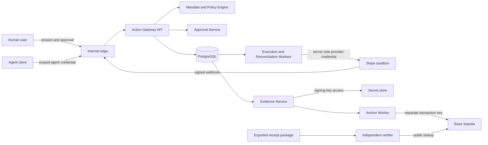

# Project Blackbox — Security Principles

| Document metadata | Value |
| --- | --- |
| Owner and final decision-maker | Malcolm Henzaga |
| Maintained by | Malcolm, with Asa and Codex |
| Version | 1.0 |
| Created / last updated | 2026-09-15 |
| Status | Active V0 security baseline; implementation has not yet been verified |
| Classification | Design document, published with the demo repository |
| Intended readers | Malcolm, Asa, Codex, future engineers, security reviewers, and approved collaborators |
| Canonical destination | `Project-Blackbox/docs/SECURITY_PRINCIPLES.md` |
| Depends on | `MASTER_CONTEXT.md`, `BUILD_PHILOSOPHY.md`, `PRODUCT_ARCHITECTURE.md` |
| Primary scope | V0 Stripe sandbox refund, human approval, signed receipt, Base Sepolia commitment, and the gates required before external or production use |

> **Security promise:** A covered provider call must not occur unless Blackbox has authenticated the actor, found an active mandate, evaluated a deterministic policy, obtained an approval bound to the exact action when required, and created a durable execution record. Evidence must state only what Blackbox can actually prove.

This document defines the security properties Project Blackbox intends to enforce. It is a build and review standard, not a certification, penetration-test result, compliance claim, or statement that the current implementation is safe for production money.

## 1. Purpose

Project Blackbox sits between software agents and consequential external actions. That position makes security part of the product itself. A failure can cause an unauthorized action, hide an authorized action, expose sensitive business data, or create evidence that appears stronger than it is.

This document establishes:

- the assets and trust boundaries Blackbox must protect;
- the threats V0 must address;
- controls that are mandatory even in the demonstration;
- the difference between sandbox, pilot, and production assurance;
- the claims cryptography and blockchain can support;
- the risks that remain after the controls are applied;
- the tests and gates required before the product handles real authority or money.

Implementation details may evolve. The security properties and evidence honesty in this document should remain stable unless Malcolm records a deliberate change.

## 2. Security objectives

Blackbox must protect six different properties. They should never be collapsed into a single word such as “verified.”

| Property | Question it answers | Primary mechanisms |
| --- | --- | --- |
| Authorization | Was this actor permitted to attempt this action under an active mandate? | Authentication, tenant isolation, mandate checks, deterministic policy, bound human approval |
| Integrity | Has the disclosed record changed since it was issued? | Canonicalization, digest, digital signature, public commitment |
| Authenticity | Which recognized issuer signed the disclosed record? | Ed25519 signature, trusted key registry, issuer configuration |
| Completeness | Did the record capture every action within the claimed scope? | Controlled provider credentials, gateway coverage, provider reconciliation, bypass detection |
| Confidentiality | Can an unauthorized party learn protected information? | Data minimization, access control, encryption, secret isolation, careful public commitments |
| Availability and recoverability | Can Blackbox make safe progress and recover without duplicating actions? | Durable state, queues, idempotency, reconciliation, backups, circuit breakers |
| Accountability | Can investigators reconstruct who did what, when, under which versioned authority? | Append-oriented events, immutable references, approval records, operational logs, signed receipts |

Cryptographic integrity is not authorization. A perfectly valid signature can cover an unauthorized or false statement if the issuing system was compromised or incorrect. Completeness is also a separate property: a valid receipt proves something about the included action, not that every relevant action passed through Blackbox.

## 3. Assurance levels

Security requirements increase with the consequence of the environment. Blackbox must never silently promote a sandbox build into a higher-assurance environment.

### 3.1 V0 demonstration

V0 is a founder-controlled technical demonstration:

- Stripe test mode only;
- Base Sepolia only;
- synthetic or deliberately non-sensitive data;
- one controlled organization, agent, approver, policy, and provider connection;
- no production funds, customer custody, or live financial authority;
- no claim of enterprise tenancy, high availability, regulatory compliance, or production-grade key custody.

V0 still requires real authorization checks, server-side secrets, durable idempotency, verified webhooks, tenant-safe query patterns, tamper detection, and negative security tests. “Demo” is not permission to fake the security-critical path.

### 3.2 Private pilot

A private pilot may introduce external users but should still avoid production financial authority until its exact scope is approved. Before a pilot, Blackbox needs stronger identity controls, explicit data terms, tested tenant isolation, managed key custody, monitoring, backup restoration, incident playbooks, and a documented support boundary.

### 3.3 Production consequential actions

Before any production action involving real money or material customer authority, Blackbox requires the gates in Section 29. These include independent security review, phishing-resistant administrator access, production key management, disaster-recovery exercises, provider-credential restriction, penetration testing, legal and privacy review, and explicit risk acceptance.

## 4. What Blackbox protects

The principal assets are:

1. **Provider authority:** Stripe or later provider credentials capable of creating side effects.
2. **Agent authority:** credentials and registrations that let software submit requests.
3. **Human authority:** login sessions, approval rights, recovery channels, and role assignments.
4. **Delegation rules:** mandates, policies, limits, effective dates, and revocation state.
5. **Action state:** normalized request, decision, approval, execution attempt, outcome, and reconciliation history.
6. **Evidence:** receipt cores, evidence manifests, signatures, public keys, and anchor records.
7. **Cryptographic secrets:** receipt-signing keys, agent-credential pepper, session keys, webhook secrets, and Base transaction keys.
8. **Restricted data:** customer identifiers, payment references, approval context, provider responses, and operational logs.
9. **Availability:** the ability to stop safely, determine uncertain outcomes, and resume without duplicated actions.
10. **Trust:** Blackbox’s ability to make precise claims that another party can independently check.

## 5. Threat actors and failure sources

V0 must assume that harm can come from both hostile actors and ordinary system failures.

- A compromised or malicious agent may submit actions outside its intended purpose, replay requests, or search for another tenant’s data.
- An external attacker may steal credentials, exploit an application flaw, forge traffic, or exhaust capacity.
- A compromised human account may approve an action the real user never saw.
- An authorized insider or operator may misuse elevated access or alter records.
- A confused component may exercise valid credentials for the wrong organization or action.
- A provider message may be forged, duplicated, delayed, reordered, or misunderstood.
- A timeout may hide whether Stripe performed an action.
- A software dependency, build pipeline, cloud service, or developer machine may be compromised.
- A chain observer may infer information from public digests, timing, frequency, or transaction origin.
- A compromised signing key may produce receipts that are cryptographically valid but fraudulent.
- A verifier may use an untrusted public key, contract, chain, or issuer configuration and reach a misleading result.

The model must also assume implementation defects: missing authorization checks, state races, incorrect retries, accidental logging, clock errors, and unsafe configuration are security problems even when no attacker is present.

## 6. Trust boundaries

Every arrow that crosses a process, network, credential, tenant, or storage boundary is untrusted until validated. Internal network location alone does not grant authority. The gateway, workers, evidence service, verifier, Stripe, and Base each have different trust assumptions and must use different credentials.

## 7. Core security invariants

These rules are non-negotiable for V0 unless a later decision record explicitly replaces one with a stronger rule.

1. An LLM does not grant authority, approve an action, choose a production credential, or decide whether a hard security rule may be bypassed.
2. Missing, ambiguous, expired, revoked, or inconsistent authority data results in no provider execution.
3. Organization, agent, and role context comes from authenticated server-side state, not caller-supplied identifiers.
4. An action version is immutable. A material change creates a new version and invalidates any prior approval.
5. Approval binds the exact action, target, amount, currency, provider, mandate version, policy version, and expiry.
6. A requester cannot approve its own action merely because it controls the request channel.
7. A hard denial cannot be overridden through a general approval endpoint.
8. Blackbox persists the logical operation and its stable provider idempotency key before crossing the provider boundary.
9. An uncertain provider result remains `UNKNOWN` until reconciled. Retrying an unknown operation never creates a fresh logical operation or a fresh idempotency key.
10. Secrets never enter browser bundles, ordinary database fields, logs, receipts, model prompts, analytics, or onchain data.
11. Provider, receipt-signing, Base transaction, session, and agent-authentication keys are separate and cannot substitute for one another.
12. Test and production credentials, databases, webhook endpoints, chains, and issuer identities stay separate.
13. Tenant access is enforced in the API and database. A client-provided organization ID is never sufficient authorization.
14. If the durable action store is unavailable, Blackbox does not make a new provider call.
15. Receipt signing and blockchain anchoring happen after the provider outcome is durably recorded. Their failure does not rewrite that outcome.
16. A Base outage leaves a receipt unanchored; it does not block, reverse, or mislabel the provider action.
17. Public chain data contains no raw customer, agent, payment, policy, approval, or receipt content.
18. V0 uses standard cryptography and no zero-knowledge proof system.

## 8. Threat and control summary

| Threat or failure | Required controls | Material residual risk |
| --- | --- | --- |
| Stolen agent credential | High-entropy scoped credential, protected verification value, rate limits, rotation, revocation, audit | A valid stolen credential can act within its remaining scope until detected or revoked |
| Phished human account | MFA, passkeys for higher assurance, recent-auth check, exact action summary, secure recovery | A compromised approved authenticator can still authorize actions |
| Cross-tenant object access | Server-derived organization context, ownership checks, database row-level controls, negative tests | Elevated database or service credentials can bypass tenant controls |
| Action changed after approval | Immutable action versions and an approval-binding digest | A flaw in canonical field selection could omit a material property |
| Approval replay | Single terminal decision, nonce/digest binding, expiry, action-state transition constraints | Clock or state-machine bugs can undermine expiry handling |
| Duplicate refund | One logical operation, database uniqueness, lock or compare-and-set, stable Stripe idempotency key | Provider behavior and retention limits require Blackbox reconciliation |
| Lost provider response | `UNKNOWN` state, replay only with the same key, provider retrieval and webhook reconciliation | Some provider failures may remain unresolved and need manual investigation |
| Forged or repeated webhook | Raw-body signature verification, timestamp tolerance, event deduplication, asynchronous processing | A leaked endpoint secret permits forged messages until rotation |
| Database alteration | Limited administrator access, append-oriented history, signed receipt, external digest commitment | An operator may omit pre-signing events or suppress an entire receipt |
| Receipt-signing key compromise | Isolated key access, rotation, revocation timeline, usage audit, production KMS/HSM | Receipts signed during an unknown compromise window may be indistinguishable from legitimate ones |
| Base transaction-key compromise | Separate low-value key, sender validation, monitoring, rotation | An attacker can publish misleading commitments from that address but cannot forge the Ed25519 receipt signature |
| Gateway bypass | Restrict provider credentials, reconcile provider activity, disclose coverage boundary | Other credentials or provider dashboard access can remain outside Blackbox’s view |
| Prompt injection | Models receive minimal data and no authority-bearing secrets; deterministic checks control action | Model-generated text can still mislead a human unless the UI separates it from verified facts |
| Supply-chain compromise | Dependency minimization, lockfiles, review, scanning, isolated CI credentials | A trusted dependency or build system can still be compromised |
| Denial of service | Rate limits, bounded queues, backpressure, circuit breakers, kill switches | External provider, database, or chain outages remain possible |
| Onchain privacy inference | Random receipt nonce, minimal fields, no direct identifiers | Timing, frequency, sender address, and gas activity remain public |

## 9. Human identity and session security

Human identity establishes who may administer the organization, change delegation, approve actions, inspect evidence, or operate incident controls.

### V0 requirements

- Use a maintained authentication provider or framework rather than custom password cryptography.
- Assign explicit roles such as administrator, approver, viewer, and operator.
- Use secure, `HttpOnly`, appropriately scoped cookies with CSRF protection for state-changing browser requests.
- Expire sessions and revoke them after password, authenticator, recovery, or high-risk role changes.
- Require recent authentication before changing credentials, roles, mandates, policies, signing configuration, provider connections, or incident controls.
- Show the exact normalized action and binding fields on the approval screen. A generic “approve” link must never execute an approval directly.
- Record the approver identity, authentication context, decision, bound action digest, and server time.

### Pilot and production direction

Privileged users should use phishing-resistant authentication such as WebAuthn/passkeys, with protected recovery and at least two registered authenticators for critical administrators. NIST SP 800-63B states that AAL2 systems must offer a phishing-resistant option and describes WebAuthn as a phishing-resistant standard. Blackbox may use this as design guidance without claiming formal NIST conformance. [NIST SP 800-63B](https://pages.nist.gov/800-63-4/sp800-63b.html)

Role assignment, authenticator recovery, and organization ownership transfer require the same or greater protection as the actions they authorize. Recovery must not become a weaker route to administrative control.

## 10. Agent identity and credentials

An agent credential identifies a registered software client. It does not prove that the software is safe, aligned, or controlled by the expected model at every moment.

Each credential should:

- contain a public key identifier and a separately generated high-entropy secret;
- be unique to one environment, organization, agent, and intended scope;
- have an issuance time, last-used time, optional expiry, and revocation state;
- support replacement without changing historical receipt identity;
- be shown only once at creation and never returned through read APIs;
- be sent only over TLS and never placed in a URL;
- be excluded from logs, traces, analytics, error reports, and model context.

The server should retain only a protected verifier for the secret, using an appropriate keyed digest or password-style secret verifier plus a separately stored server pepper. Comparison must avoid timing leaks. The database record should permit lookup by the public key identifier without scanning secrets.

Authentication establishes the agent record. The API then derives organization and allowed action types from that server-side record. Headers or JSON fields that claim a different organization, agent, role, environment, or scope are rejected.

Credential creation, rotation, revocation, failed authentication, and anomalous use are security events. V0 must demonstrate that a revoked credential cannot submit a new action.

## 11. Service identities and least privilege

Each service receives only the authority needed for its job:

- the public API can authenticate requests and create action records but does not possess the receipt-signing or Base transaction key;
- the execution worker can read approved operations and use the configured Stripe test credential but cannot alter mandates or approvals;
- the evidence service can read immutable evidence inputs and use the receipt-signing key but cannot call Stripe;
- the anchor worker can read queued digests and use the Base transaction key but cannot decrypt receipt content or sign receipts;
- the verifier needs public keys and public chain configuration only.

Production should prefer short-lived workload identity and managed secret access over shared static credentials. Emergency operator access must be time-bound, attributable, reviewed, and disabled by default.

## 12. Authorization and tenant isolation

Authorization occurs on every request and background job, including reads. A prior check in the UI or an earlier workflow step does not authorize a later operation.

Required controls:

- derive organization and principal from the authenticated identity;
- check role, resource ownership, action type, mandate, policy, and current state;
- use database foreign keys and uniqueness constraints that include organization identity where appropriate;
- use database row-level security or equivalent controls as defense in depth;
- test that every object endpoint rejects unauthenticated, wrong-role, wrong-agent, and wrong-organization access;
- prevent tenant identifiers from colliding in caches, job names, object storage, exports, and log links;
- keep database service-role credentials exclusively on trusted servers.

For a Supabase implementation, row-level security and table grants must be designed together. Supabase documents that service-role clients bypass row-level security and must remain server-side. [Supabase row-level security](https://supabase.com/docs/guides/database/postgres/row-level-security) [Supabase API security](https://supabase.com/docs/guides/api/securing-your-api)

Database policies supplement application authorization; they do not replace checks for mandate scope, policy result, approval binding, or workflow state.

## 13. Mandate and policy security

A mandate expresses delegated authority. A policy decides what Blackbox may do with a normalized request under that mandate. Both are security-sensitive configuration.

- Mandates and policies are versioned and immutable after activation.
- Edits create new versions; historical actions retain their original references and digests.
- Activation, suspension, revocation, and replacement are authenticated, authorized, and logged.
- A revoked or expired mandate blocks execution even if it was valid when the request arrived, unless a future product policy explicitly defines and records another rule.
- Policy evaluation is deterministic and side-effect free.
- Missing fields, unsupported currencies, invalid amounts, unknown action types, ambiguous targets, and evaluation errors produce denial or escalation, never implicit allow.
- Hard limits are represented in authoritative structured data, not natural-language prompts.
- Amounts use integer minor units and validated currency semantics.
- Time windows use trusted server time in UTC, with explicit boundary behavior.

Models may help a user draft policy text or explain a deterministic result. A human must review generated policy, and executable policy must pass schema validation and tests before activation.

## 14. Approval security

Approval is authorization for one exact action version, not a reusable vote of confidence in the agent.

The approval binding must cover at least:

- organization and action identifiers;
- action version and type;
- provider and environment;
- target reference;
- amount and currency;
- mandate identifier, version, and digest;
- policy identifier, version, decision, and digest;
- approval expiry and a unique nonce or equivalent replay-resistant value.

The approver sees these same material fields, plus the policy reasons and any evidence clearly labeled by source. Changing a bound field invalidates the approval. An approval has one terminal decision and cannot be reused after rejection, expiration, cancellation, execution, or replacement of the action version.

The server rechecks identity, role, organization, current state, binding digest, expiry, mandate status, and policy status at decision time and again before execution. Browser protections include CSRF defense, output encoding, safe redirect handling, and recent-auth checks for consequential approvals.

A future customer may require separation of duties, quorum approval, or policy-specific approver groups. V0 must not imply those controls exist.

## 15. Provider credentials and gateway coverage

The provider credential is the capability that ultimately creates the refund. It receives stronger protection than ordinary application data.

- Stripe secrets stay on trusted servers in an approved secret store or deployment secret facility.
- The browser, agent, model, receipt, database, chain, and client-visible error never receive the secret.
- Test and live keys are never accepted by the same V0 connection.
- Use a restricted Stripe key when the required refund workflow can be expressed with the needed permissions.
- Apply IP restrictions or equivalent provider access controls where operationally feasible.
- Give each environment and provider connection a separate secret and webhook endpoint.
- Record ownership, purpose, creation, rotation, and revocation without recording the secret value.
- Rotate on staff change, suspected exposure, scope change, or scheduled policy.

Stripe advises storing secret keys in a secrets vault or environment variables, using restricted keys to limit damage, applying access restrictions, and rotating exposed keys. [Stripe API keys](https://docs.stripe.com/keys)

V0’s valid coverage claim is narrow:

> Blackbox records and controls refund requests sent through the configured gateway using the registered Stripe sandbox connection.

It cannot claim that every refund for an account passed through Blackbox if another secret, dashboard session, application, or provider route can create refunds. Stronger completeness requires constrained provider authority and reconciliation that flags unmatched provider activity.

## 16. Safe execution, idempotency, and reconciliation

The execution path treats a provider call as a recoverable distributed operation, not a simple function call.

1. Validate the current mandate, policy, approval, and action state.
2. Create or load one durable logical operation and its stable provider idempotency key.
3. Atomically claim the operation using a database lock, lease, or compare-and-set transition.
4. Call Stripe with the approved normalized parameters and the persisted key.
5. Store the response or mark the outcome unknown if the response cannot establish what happened.
6. Reconcile using provider retrieval, verified webhooks, or safe replay with the same key.
7. Never create a second logical refund to resolve an uncertain first one.

Database uniqueness must prevent two workers from owning distinct provider keys for the same logical action. Job delivery can repeat; the side effect must remain logically singular.

Stripe supports idempotency keys on POST requests and returns the saved result when a request with the same key is repeated within its supported behavior. Blackbox must retain its own durable operation record because provider-side retention is not a permanent deduplication system. [Stripe idempotent requests](https://docs.stripe.com/api/idempotent_requests)

A timeout is not evidence of failure. A manual “retry” control must trigger reconciliation or reuse the existing logical operation; it must not silently generate a new key.

## 17. Webhook security

Webhook traffic arrives without a human or agent session. Blackbox trusts it only after verifying the provider signature for the exact configured endpoint and environment.

Required behavior:

- preserve the raw request bytes before JSON parsing or transformation;
- verify the `Stripe-Signature` against the endpoint secret and an explicit timestamp tolerance;
- reject invalid, stale, oversized, or malformed messages;
- deduplicate by provider event ID and guard against semantically repeated object transitions;
- acknowledge valid deliveries promptly and process them asynchronously;
- make handlers idempotent and safe under duplication, delay, and reordering;
- retrieve the provider object when the event alone is insufficient to establish current state;
- never treat an event’s customer or organization reference as authorization for a different tenant;
- avoid logging the full payload when it contains restricted data.

Stripe’s verification procedure requires the unmodified UTF-8 body, the `Stripe-Signature` header, and the endpoint secret. Body mutation can cause verification to fail. [Stripe webhook signatures](https://docs.stripe.com/webhooks/signature)

Webhook-secret rotation must support a controlled overlap if the provider sends multiple valid signatures during transition. Failed verification and unusual replay volume should alert without exposing signature material.

## 18. Receipt integrity and evidence claims

V0 uses established cryptographic building blocks:

- RFC 8785 JSON Canonicalization Scheme for deterministic receipt-core bytes;
- SHA-256 for the receipt digest;
- Ed25519 for the issuer signature over the canonical receipt-core bytes;
- a stable issuer key ID and public-key fingerprint;
- a separately verifiable Base Sepolia commitment to the digest.

Ed25519 is standardized in [RFC 8032](https://www.rfc-editor.org/rfc/rfc8032), and JSON canonicalization is specified by [RFC 8785](https://www.rfc-editor.org/rfc/rfc8785.html). Implementations must use maintained libraries and fixed interoperability test vectors. Blackbox must not implement a signature algorithm, hash function, or canonicalizer from scratch.

The evidence service builds receipts from durable system records. A caller cannot supply a claimed result such as “refund succeeded.” The service signs the exact canonical bytes and stores or returns the associated digest; it does not sign a parsed object that another layer may later serialize differently.

Each receipt core contains an independently generated 256-bit `commitmentNonce`. Because some receipt fields have a small set of likely values, this nonce prevents a chain observer from matching a public digest against simple guessed receipt contents. The nonce remains inside the private signed receipt and is disclosed only with that receipt package.

The nonce does not hide transaction timing, anchor frequency, sender address, gas use, or the fact that a commitment occurred. It also does not repair weak random generation or disclosure of the full receipt.

### What a valid receipt supports

A correctly verified receipt can support these bounded statements:

- the disclosed receipt core has not changed since the recognized issuer signed it;
- the signature verifies under a specified public key;
- the digest was committed by a specified address to a specified contract and chain, if the anchor checks pass;
- the receipt contains Blackbox’s signed account of the stated authority, decision, execution, and observations.

### What it does not support by itself

A valid receipt does not prove:

- that all relevant actions were captured;
- that the original provider data or human assertion was true;
- that the action was legally authorized or commercially wise;
- that an agent behaved safely before or after the recorded action;
- that the signing key was uncompromised at issuance;
- that a policy was fair, compliant, or free of configuration mistakes;
- that a blockchain validated the refund or assumed liability for it.

The verifier reports digest, signature, issuer, schema, anchor, and evidence-level checks separately. It must show limitations and must not replace them with one unexplained “verified” badge.

## 19. Cryptography versus zero-knowledge proofs

V0 uses cryptography. It does not use zero-knowledge proofs.

| V0 mechanism | Purpose | Privacy property |
| --- | --- | --- |
| SHA-256 digest | Compact commitment to the exact canonical receipt | Does not encrypt the receipt; the random commitment nonce makes guessing harder |
| Ed25519 signature | Detect changes and attribute issuance to a trusted key | Does not hide signed fields from a receipt holder |
| Base Sepolia commitment | Give the digest a public, independently checkable witness | Publishes digest, issuer address, timing, and transaction metadata |
| TLS and storage encryption | Protect data in transit and at rest | Protects against specified transport or storage access, not an authorized recipient |

A zero-knowledge proof would serve a different product need: proving a statement such as “the amount was within an approved limit” without revealing the amount or full receipt. That adds circuits, proving and verification software, parameter and upgrade decisions, new audit work, performance costs, and subtle privacy risks.

Blackbox should consider zero-knowledge proofs only when customer discovery identifies a concrete verifier, hidden field, required predicate, disclosure policy, and acceptable trust model. A future experiment should use a narrowly specified standard proof system and independent review. It must not delay V0 or be presented as a security upgrade without a defined privacy requirement.

## 20. Key and secret management

Every secret has one purpose, one owner, an environment, an access policy, and a lifecycle.

| Secret or key | Capability | Minimum V0 treatment | Production direction |
| --- | --- | --- | --- |
| Stripe test secret | Create sandbox provider actions | Server-only deployment secret; restricted scope where possible | Managed secret store, restricted credential, audited access, rotation |
| Stripe webhook secret | Authenticate one webhook endpoint | Separate per environment and endpoint | Managed rotation and delivery monitoring |
| Receipt Ed25519 private key | Issue authentic Blackbox receipts | Evidence-service-only secret; never export in output | Non-exportable KMS/HSM or equivalently reviewed custody |
| Receipt public key | Verify receipts | Publish with stable ID and fingerprint | Trusted registry with effective and revocation times |
| Base transaction private key | Publish commitments | Separate key holding only test ETH | Isolated key with minimal funds and monitored use |
| Agent-credential pepper | Protect stored credential verifiers | Server-only, separate from database | Managed secret with controlled rotation plan |
| Session/auth keys | Establish human sessions | Authentication-system secret | Managed rotation and strong recovery controls |

The lifecycle covers secure generation, registration, activation, distribution, use, rotation, retirement, revocation, archival where verification requires it, and destruction. NIST’s key-management guidance provides a useful framework for managing cryptographic key material across its lifecycle. [NIST key-management guidelines](https://csrc.nist.gov/Projects/Key-Management/Key-Management-Guidelines)

Receipt public-key history must include the key ID, algorithm, fingerprint, issuer, valid-from time, retirement time, and compromise or revocation status. Rotation cannot erase historical verification. If a private key may have been compromised, Blackbox must publish the suspected interval and avoid claiming that every signature in that interval is trustworthy.

The Base key must never hold customer assets or meaningful treasury funds. Compromise of that key must not grant access to the receipt signer, Stripe, database, or administrator session.

Backups containing secrets require protections at least as strong as the live secret. No secret should appear in source control, fixtures, screenshots, copied commands, support tickets, or generated documentation.

## 21. Blockchain and smart-contract security

V0 uses Base Sepolia as a public witness for a receipt digest. The chain is not an authorization engine, provider oracle, identity system, or source of legal truth.

The contract should be minimal:

- accept a `bytes32` receipt digest and schema identifier;
- associate the commitment with the transaction sender;
- reject or harmlessly handle duplicate submission according to one documented rule;
- emit an event and provide a simple lookup;
- hold no funds and contain no token, governance, arbitrary external call, proxy, or upgrade path;
- contain no private receipt content;
- use a pinned compiler and checked dependencies;
- resolve all compiler warnings before deployment;
- avoid authorization based on `tx.origin`;
- have unit, negative, duplicate, and deployment-configuration tests;
- record and verify the deployed source, bytecode, chain ID, contract address, and expected issuer address.

Solidity’s security guidance emphasizes that contract data is public, recommends keeping contracts small and modular, and warns against `tx.origin` authorization. [Solidity security considerations](https://docs.soliditylang.org/en/latest/security-considerations.html)

The verifier must validate the expected chain ID, contract address, issuer address, digest, block identity, and confirmation rule. Finding the digest in an attacker-controlled contract or from an unexpected issuer is not a valid Blackbox anchor.

Anchoring is asynchronous. A chain outage, transaction replacement, dropped transaction, rate limit, or reorganization moves only the anchor state. It cannot change the durable Stripe outcome or the signed receipt. The UI must distinguish `NOT_SUBMITTED`, `PENDING`, `ANCHORED`, and `FAILED` or equivalent states.

## 22. Data protection and privacy

Blackbox minimizes data before deciding how to encrypt it.

### Classification

- **Secret:** provider keys, webhook secrets, private signing and transaction keys, session secrets, agent credentials.
- **Restricted:** direct customer or payment identifiers, approval context, provider payloads, recovery data, detailed security events.
- **Internal:** pseudonymous action records, policies, mandates, aggregated operational data.
- **Public:** intentionally published schema IDs, receipt digest, issuer address, contract address, transaction reference, and public verification keys.

### Requirements

- Collect only fields required to authorize, execute, reconcile, and support the stated evidence claim.
- Use pseudonymous internal references in receipts when a direct provider identifier is unnecessary.
- Do not store card data, authentication factors, model chain-of-thought, unrestricted prompts, or unrelated provider payload fields.
- Encrypt network traffic and rely on reviewed platform encryption for storage; add field-level protection where the threat model requires it.
- Redact secrets and restricted values from logs, traces, analytics, error reports, and support exports.
- Prevent receipt exports and verifier uploads from becoming a new uncontrolled data-sharing channel.
- Use synthetic fixtures in V0.
- Define retention, deletion, backup expiry, export, and legal-hold behavior before a private pilot.
- Explain that an onchain commitment and its transaction metadata are effectively permanent even if the private receipt is deleted.

Cross-border use, insurer access, actuarial analysis, model training, and secondary aggregation need explicit contractual, privacy, consent, and legal review before customer data enters those flows.

## 23. API and application security

All public and internal interfaces use strict contracts.

- Validate types, length, format, range, enum membership, content type, and allowed fields.
- Reject unknown fields on authority-bearing requests where forward compatibility could hide caller mistakes.
- Require positive integer minor-unit amounts and supported currency/action combinations.
- Authenticate before resource lookup where practical to limit identifier probing.
- Enforce authorization on reads, exports, searches, jobs, and mutations.
- Use request-size limits, timeouts, rate limits, and bounded pagination.
- Protect browser mutations from CSRF and user-controlled output from script injection.
- Restrict CORS to explicit origins and use secure cookie settings.
- Do not fetch arbitrary caller-supplied URLs from trusted networks.
- Keep internal stack traces, SQL details, provider errors, and credential hints out of client responses.
- Avoid sequential identifiers that unnecessarily reveal volume or facilitate probing.
- Preserve a client request ID only as a correlation value; do not mistake it for a trusted idempotency or authorization key.

The same validation library or schema should govern API input, normalized domain objects, approval display, provider mapping, and receipt generation wherever practical. Differences between those representations require explicit tests.

## 24. Database, storage, and backup security

PostgreSQL is the V0 application system of record. Security depends on the database preserving relationships and state transitions under concurrency.

- Use transactions, foreign keys, check constraints, uniqueness constraints, and immutable or append-oriented event records.
- Keep action versions, policy decisions, approvals, execution attempts, provider observations, and receipt inputs historically attributable.
- Do not expose sensitive tables directly to browser clients.
- Apply least-privilege database roles and row-level controls where supported.
- Log elevated data changes and migration activity without logging protected values.
- Separate development, test, pilot, and production databases and credentials.
- Encrypt backups, control access, define retention, and test restoration before a pilot.
- Protect schema migration and seed paths from inserting live secrets or weakening policies.

A receipt signature can reveal later changes to the disclosed signed core. It cannot reveal every deleted database row, an event omitted before signing, a suppressed receipt, or rollback to an earlier database backup. External commitments improve detection for issued receipts; they do not make the operational database complete by themselves.

## 25. Secure development and supply chain

Security work occurs throughout design, implementation, review, deployment, and maintenance. NIST’s Secure Software Development Framework recommends integrating secure practices into the software lifecycle to reduce vulnerabilities and their underlying causes. [NIST SP 800-218](https://csrc.nist.gov/pubs/sp/800/218/final)

Project practices should include:

- a committed lockfile and pinned versions for security-sensitive build tools;
- few dependencies, with a reason for each cryptography, identity, provider, or contract dependency;
- automated secret scanning before merge and deployment;
- dependency vulnerability and license checks;
- static analysis, type checking, linting, and relevant framework security checks;
- review of generated code and migrations by a human who understands the affected boundary;
- protection of CI tokens, deploy credentials, release artifacts, and branch settings;
- reproducible receipt test vectors and contract deployment records;
- prompt patching or isolation of a vulnerable dependency according to consequence, exploitability, and exposure;
- separate development and deployment credentials;
- no use of live customer data in tests.

AI-generated code receives the same review as human-generated code. Passing compilation or unit tests is not evidence that authorization, concurrency, or cryptographic composition is correct.

## 26. Availability, abuse resistance, and safe shutdown

Availability controls must preserve authorization and idempotency under pressure.

- Rate-limit by authenticated agent, organization, user, route, and risk signal as appropriate.
- Cap request size, action amount, action velocity, pending approvals, and queued executions.
- Use bounded queues, worker leases, retry budgets, backoff, and dead-letter handling.
- Provide organization-level and global execution kill switches.
- Allow read-only inspection and reconciliation during a write stop where safe.
- Stop new provider calls when database durability, credential integrity, authority checks, or time validity cannot be trusted.
- Do not disable signature, approval, tenancy, or idempotency checks to restore throughput.
- Monitor provider, database, authentication, and chain dependencies separately.

The kill switch blocks new provider execution and records why. It must not discard in-flight state. On recovery, Blackbox reconciles claimed or unknown operations before starting new ones.

## 27. Failure posture

| Condition | Required behavior |
| --- | --- |
| Authentication invalid or unavailable | Reject the request; do not create a provider operation |
| Tenant or role cannot be established | Reject; do not reveal whether the target resource exists |
| Mandate missing, expired, or revoked | Deny execution |
| Policy missing, ambiguous, or failed | Deny or explicitly require authorized resolution; never implicit allow |
| Required approval missing, changed, replayed, or expired | Deny execution |
| Durable database write unavailable | Do not cross the provider boundary |
| Concurrent workers claim one action | Exactly one proceeds; the others observe the durable operation |
| Provider gives definite business rejection | Record `FAILED` with normalized, non-sensitive reason |
| Provider response is lost or ambiguous | Record `UNKNOWN`; reconcile using the same operation key |
| Webhook signature invalid | Reject and record limited security telemetry |
| Receipt signing fails after execution | Preserve provider outcome; mark receipt failure and retry signing safely |
| Base submission fails | Preserve signed receipt; mark anchor failed or pending and retry separately |
| Chain reorganizes the observed block | Return anchor to pending until the confirmation policy is satisfied again |
| Verifier unavailable | No effect on authorization, provider state, or receipt validity |
| Trusted server clock is unreliable | Stop expiry-sensitive approval and execution paths |

This design fails closed for authority and durable execution prerequisites. It represents external uncertainty explicitly and allows post-execution evidence services to recover asynchronously.

## 28. Monitoring and incident response

### Security monitoring

Alerting should cover:

- repeated or anomalous human and agent authentication failures;
- role, authenticator, recovery, mandate, policy, credential, and provider-connection changes;
- cross-tenant authorization failures and object-enumeration patterns;
- unexpected approval volume, amount, velocity, or repeated expiry;
- duplicate execution claims and rising `UNKNOWN` outcomes;
- invalid or replayed webhook signatures;
- receipt-signing failure or unexpected signing-key use;
- Base commitments from an unexpected sender or unexpected contract configuration;
- provider actions with no matching Blackbox operation where reconciliation can observe them;
- secret-scanner, dependency, static-analysis, deployment, and backup failures;
- kill-switch activation and attempted execution while stopped.

Metrics and logs must remain useful without containing secrets or unnecessary restricted data. Every alert needs an owner, severity, investigation link, and tested action.

### Incident response

Blackbox should follow a documented cycle of preparation, detection and analysis, containment, eradication, recovery, and learning. NIST SP 800-61 Revision 3 provides current incident-response guidance aligned with the NIST Cybersecurity Framework. [NIST SP 800-61 Rev. 3](https://csrc.nist.gov/pubs/sp/800/61/r3/final)

At minimum, create playbooks for:

| Incident | Immediate containment priorities |
| --- | --- |
| Agent credential exposure | Revoke credential, stop its pending actions, preserve logs, inspect actions since last known safe use |
| Human administrator compromise | Revoke sessions and authenticators, freeze privileged changes and execution, review approvals and recovery events |
| Stripe credential exposure | Activate execution kill switch, revoke or rotate at Stripe, reconcile provider activity, inspect CI and logs |
| Receipt-signing key exposure | Stop issuance, secure remaining material, publish key status and suspected interval, rotate issuer key, preserve affected receipts |
| Base transaction-key exposure | Stop anchoring, move to a new issuer address, inspect unexpected commitments, keep receipt-signing analysis separate |
| Tenant-data exposure | Contain access, preserve evidence, establish affected fields and tenants, engage legal/privacy response |
| Possible duplicate refund | Stop relevant execution path, reconcile by action and provider IDs, do not issue compensating action without human review |
| Gateway bypass detected | Restrict external provider access, identify unmatched actions, correct coverage claims and customer reporting |

Incident records should preserve evidence, decisions, timelines, and affected versions. Notification duties and regulator or customer communications require counsel and applicable contract review.

## 29. Verification and release gates

### 29.1 V0 security acceptance

V0 is demonstrable only after all applicable checks pass in a freshly deployed test environment:

- Stripe is in test mode and Base is Sepolia chain ID `84532`. [Base network information](https://docs.base.org/base-chain/api-reference/rpc-overview)
- Fixtures contain no live customer or payment data.
- Secrets exist only in approved server-side secret locations.
- Unauthenticated, unauthorized, revoked-agent, wrong-role, and wrong-organization requests fail.
- A changed action, target, amount, currency, policy, mandate, provider, environment, or expired binding cannot reuse approval.
- A policy denial creates no Stripe refund call.
- Concurrent and repeated jobs create at most one logical refund.
- A lost-response scenario becomes `UNKNOWN` and reconciles without a new logical operation key.
- Invalid, stale, modified, duplicate, and reordered webhooks behave safely.
- Receipt test vectors reproduce the same canonical bytes, digest, and Ed25519 verification across the supported verifier implementations.
- Altering any signed receipt-core field makes verification fail.
- A wrong public key, issuer, chain, contract, sender, digest, or insufficient confirmation does not show a valid anchor.
- The public contract contains only the approved digest, schema, issuer, and transaction metadata.
- The receipt commitment nonce is independently random, signed, retained with the receipt, and absent as a separate chain field.
- Logs and client responses pass secret and restricted-data review.
- Source, artifact, image, and dependency scans reveal no committed secret.
- The execution kill switch blocks new provider calls without deleting state.
- The full acceptance demonstration works after a clean deployment from documented configuration.

Passing V0 acceptance authorizes a sandbox demonstration only.

### 29.2 Required before a private external pilot

- documented pilot scope, prohibited data, and acceptable action authority;
- tested tenant isolation across API, database, jobs, caches, exports, and verifier flows;
- MFA with protected administrator recovery and step-up for sensitive changes;
- managed secrets, key ownership, rotation, revocation, and backup procedures;
- explicit retention, deletion, export, privacy, support, and incident-notification terms;
- monitored backups and a successful restoration exercise;
- actionable alerts and rehearsed incident playbooks;
- provider scope and bypass analysis for the pilot account;
- dependency, application, API, and smart-contract security review;
- written residual-risk acceptance by the owner and pilot customer.

### 29.3 Required before production money or material authority

- independent application, cloud, cryptographic-design, and smart-contract review;
- penetration test with high-severity findings resolved and retested;
- phishing-resistant privileged access and hardened recovery;
- production KMS/HSM or equivalently reviewed non-exportable signing-key custody;
- distinct production workload identities and least-privilege database roles;
- restricted provider credentials and tested unmatched-activity reconciliation;
- high-availability, recovery-point, recovery-time, and failover requirements with exercises;
- vulnerability-management, patching, monitoring, on-call, and incident-communications processes;
- privacy, data-processing, regulatory, insurance, contract, and claims-language review;
- a documented threat-model review after the final production architecture exists;
- explicit launch decision and residual-risk acceptance.

Until those gates pass, Blackbox must not market V0 as production-secure, compliant, audited, insured, or suitable for live financial authority.

## 30. Residual risks and honest limits

Even a well-implemented design retains material risks:

- Blackbox is initially a centralized issuer. Verifiers depend on its key registry and on evidence Blackbox chose to include.
- An administrator, cloud operator, compromised build, or database credential may suppress actions or alter data before receipt issuance.
- External provider credentials or dashboard access can bypass the gateway.
- Customer mistakes in mandates, policies, roles, and provider setup can authorize harmful behavior.
- Stripe, the identity provider, database platform, hosting platform, RPC provider, and Base remain external dependencies.
- Public commitment timing and frequency may reveal business activity even when receipt data is hidden.
- A signing-key compromise creates uncertainty for signatures in the compromise interval.
- A solo founder creates concentration risk for secret recovery, incident response, review, and operational continuity.
- No independent audit, penetration test, formal verification, or production incident exercise has yet occurred.
- A signed and anchored receipt proves the integrity of disclosed evidence, not the absence of undisclosed actions.
- Technical evidence does not determine legal responsibility, insurance coverage, regulatory compliance, or liability.

These limits belong in product language, verifier output, pilot materials, and diligence responses wherever a reader could otherwise infer a stronger guarantee.

## 31. Open security decisions

### Required during V0 implementation

1. Which authentication provider and session architecture will the console use?
2. What roles can create, activate, suspend, or revoke mandates and policies?
3. What exact fields, encoding, expiry, and nonce define the approval-binding digest?
4. How will agent secrets be generated, verified, rotated, and revoked?
5. Where will the V0 Ed25519 private key, agent pepper, Stripe test key, webhook secret, and Base key live?
6. What cryptographic library and RFC 8785 implementation will be pinned, and what cross-language test vectors will be published?
7. What Stripe API version, webhook tolerance, event set, retry limit, and reconciliation window will be fixed for the demo?
8. What database authorization pattern and row-level policies will be used?
9. What rate limits, amount limits, velocity limits, and kill-switch controls apply to V0?
10. Which logs are security-relevant, which fields are redacted, and how long are they retained?
11. Who controls the trusted issuer registry used by the independent verifier?
12. What exact Base confirmation and reorganization policy applies to the demonstration?

### Required before pilot or production

13. What customer threat model, deployment model, and division of security responsibility apply?
14. Can the provider credential be restricted tightly enough for the intended coverage claim?
15. How will Blackbox detect actions taken through alternative provider credentials or dashboards?
16. What data may be retained, disclosed to a verifier, used for actuarial analysis, or transferred across borders?
17. What recovery and continuity plan works if Malcolm is unavailable?
18. Which independent reviewers and testing firms are appropriate for the final stack?
19. What breach, fraud, financial-loss, and availability obligations appear in customer contracts?
20. Is there a validated selective-disclosure need that justifies a zero-knowledge proof, and exactly which statement must it prove?

## 32. Relationship to the product and build documents

- `MASTER_CONTEXT.md` explains the company thesis, founder context, ambitions, customer wedge, and current strategic assumptions.
- `BUILD_PHILOSOPHY.md` explains how Malcolm, Asa, Codex, and future engineers should decompose, implement, review, and learn from the build.
- `PRODUCT_ARCHITECTURE.md` defines V0 actors, components, state machines, data, APIs, receipt structure, provider flow, and acceptance behavior.
- `SECURITY_PRINCIPLES.md` defines the adversarial assumptions, security invariants, control expectations, evidence limits, and promotion gates for those systems.

If an implementation choice conflicts with this security baseline, stop the affected release path, record the conflict, and resolve it through an explicit decision. Convenience and demo timing do not silently weaken an invariant.

## 33. Source record and maintenance

### Internal sources

- `MASTER_CONTEXT.md`, version 1.0.
- `BUILD_PHILOSOPHY.md`, version 1.0.
- `PRODUCT_ARCHITECTURE.md`, version 1.0.
- “AI Web3 Business Ideas” conversation (ID withheld).

### Primary security and platform sources checked 2026-09-15

- [NIST SP 800-61 Rev. 3 — Incident Response Recommendations and Considerations for Cybersecurity Risk Management](https://csrc.nist.gov/pubs/sp/800/61/r3/final)
- [NIST SP 800-63B — Authentication and Authenticator Management](https://pages.nist.gov/800-63-4/sp800-63b.html)
- [NIST SP 800-218 — Secure Software Development Framework](https://csrc.nist.gov/pubs/sp/800/218/final)
- [NIST — Key Management Guidelines](https://csrc.nist.gov/Projects/Key-Management/Key-Management-Guidelines)
- [RFC 8032 — Edwards-Curve Digital Signature Algorithm](https://www.rfc-editor.org/rfc/rfc8032)
- [RFC 8785 — JSON Canonicalization Scheme](https://www.rfc-editor.org/rfc/rfc8785.html)
- [Stripe — API keys](https://docs.stripe.com/keys)
- [Stripe — Idempotent requests](https://docs.stripe.com/api/idempotent_requests)
- [Stripe — Resolve webhook signature verification errors](https://docs.stripe.com/webhooks/signature)
- [Supabase — Row Level Security](https://supabase.com/docs/guides/database/postgres/row-level-security)
- [Supabase — Securing your API](https://supabase.com/docs/guides/api/securing-your-api)
- [Solidity — Security Considerations](https://docs.soliditylang.org/en/latest/security-considerations.html)
- [Base — RPC overview and network information](https://docs.base.org/base-chain/api-reference/rpc-overview)

Standards, platform behavior, libraries, and provider controls change. Recheck authoritative sources when implementing the relevant control, pin versions where behavior affects security, and record deviations.

### Maintenance rule

Update this document when Blackbox changes an authority boundary, identity model, credential, provider, data class, cryptographic profile, public evidence claim, chain, deployment environment, or assurance level. Record a material decision and rationale in `DECISIONS.md` when that file exists.

Security status must stay separate from design intent. Mark a control implemented only after it exists, tested only after the named test passes, and production-ready only after every applicable gate is evidenced and the remaining risk is explicitly accepted.

**Decision anchor:** Blackbox earns trust by preventing unauthorized covered actions, preserving uncertainty instead of guessing, limiting sensitive disclosure, and making every evidence claim no stronger than the mechanisms that support it.
